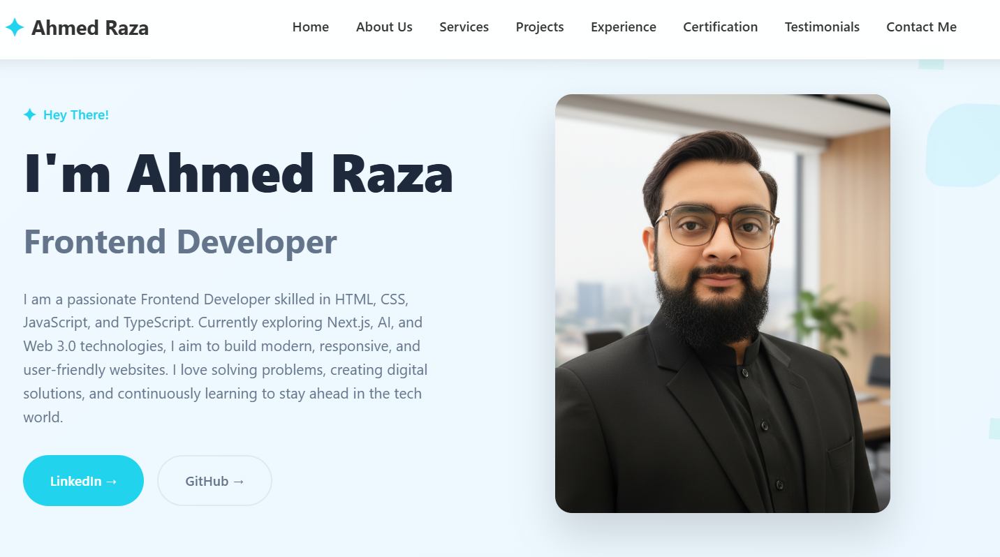

# 🌐 Ahmed Raza - Personal Portfolio

Welcome to my personal portfolio website repository!  
This portfolio is built using **HTML, CSS, and JavaScript** to showcase my projects, skills, and journey in the IT field.

---

## 🚀 Features

- Fully responsive design  
- Clean and modern UI  
- Interactive sections (Projects, About, Contact)  
- Smooth animations and transitions  
- Loader spinner before content loads  

---

## 🛠️ Tech Stack

- **HTML5**  
- **CSS3** (Custom CSS)  
- **JavaScript (ES6)**  

---

## 📸 Preview

  

---

## 🔗 Live Demo

👉 [Click here to view my Portfolio](https://github.com/irazaahmed/MyPortfolio.git)  

---

## 📂 Folder Structure

portfolio/
│── index.html
│── style.css
│── script.js
│── assets/
│ ├── images/
│ ├── icons/
│── README.md

---

## ✨ Sections in Portfolio

- **Home / Hero Section** – Quick intro and highlights  
- **About Me** – Background, education, and career goals  
- **Projects** – Showcase of my work with descriptions  
- **Contact** – Easy way to connect with me  

---

## 📬 Contact

If you want to collaborate or connect with me:  

- GitHub: [AhmedRaza](https://github.com/irazaahmed)  
- LinkedIn: [Ahmed Raza](https://www.linkedin.com/in/irazaahmed/)  
- Email: hafizahmedraza12345@gmail..com  

---

⭐ Don’t forget to **star this repo** if you like it!
